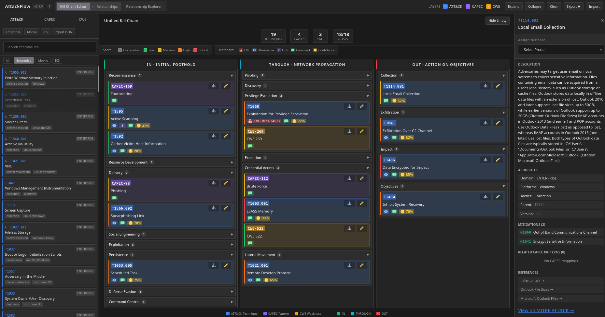
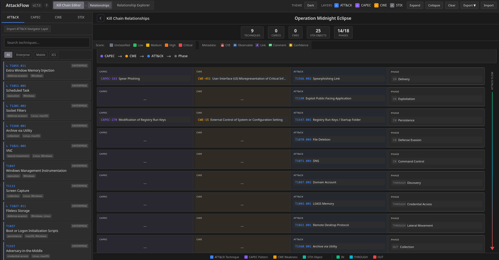
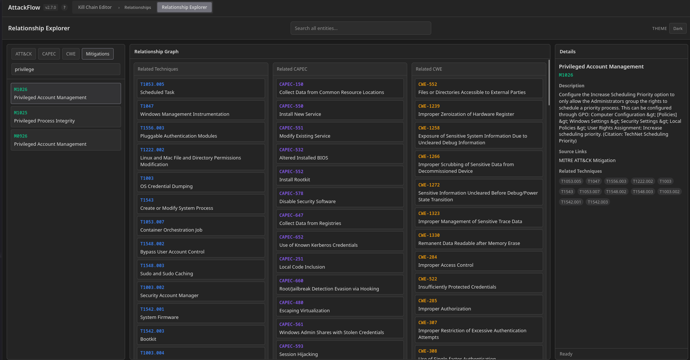

# AttackFlow - Kill Chain Editor & Visualizer

An editor for creating enriched Cyber Kill Chain assessments by mapping MITRE ATT&CK, CAPEC, CWE & STIX 2.1 objects to the Unified Kill Chain framework and enriching phase parts with additional data. Visualize and assess complex attack scenarios easily by combining flexible TTPs with atomic IOCs and forensic data.

### Work in progress 


## Main Editor


## Features

- **Vanilla JavaScript** — No external dependencies, runs in any browser
- **Unified Kill Chain** — Map entities to IN → THROUGH → OUT phases
- **Multi-Domain ATT&CK** — 898 techniques across Enterprise, Mobile, and ICS
- **CAPEC/CWE Integration** — Link attack patterns and weaknesses
- **STIX 2.1 Objects** — Create and manage all 18 SDO types plus custom objects
- **STIX Bundle Import** — Import any STIX 2.1 bundle JSON to extract SDOs with full property preservation
- **STIX Editor** — Edit all spec-defined fields per SDO type with vocabulary dropdowns
- **Drag & Drop** — Intuitive assignment of entities to phases
- **Grouping** — Organize items into collapsible groups within phases
- **Duplicates** — Allow multiple instances of the same entity
- **Rich Metadata** — Comments, hyperlinks, observables, multi-CVE/CVSS references
- **Score & Confidence** — Rate items by severity and assessment confidence
- **Visual Indicators** — Color-coded ribbons, CVE badges, and metadata icons
- **Light/Dark Theme** — Toggle theme with shared settings across views
- **Compact Mode** — Dense ID-only tags to fit large kill chains
- **Relationship Explorer** — Browse ATT&CK ↔ CAPEC ↔ CWE ↔ Mitigations in a dedicated view
- **Hide Empty Phases** — Focus on active phases by hiding empty ones
- **Collapsible Sidebar** — Toggle the left sidebar for more workspace
- **Import/Export** — Lightweight JSON sharing, CSV exports, and STIX bundle exports
- **Navigator Layers** — Import ATT&CK Navigator JSON exports
- **Offline Operation** — No CDN, no remote requests, no third-party dependencies

## Relations View


## Explorer View


## Quick Start

The Relationship Explorer is a second main view that lets you investigate ATT&CK ↔ CAPEC ↔ CWE ↔ Mitigations without assigning items first. Use the header navigation to switch views, click any node to load its details in the right panel, and open mitigation links to explore cross‑framework relationships in context.

1. Clone or download this repository
2. Open `index.html` in a browser, or deploy to a web server
3. Browse techniques in the left sidebar
4. Drag items onto kill chain phases
5. Click items in the diagram to add metadata
6. Switch to the **STIX** tab to create or import STIX 2.1 objects
7. Click **Import STIX Bundle** to load a STIX 2.1 bundle JSON (e.g., Operation Midnight Eclipse bundle)
8. Use the header navigation to switch to Relationship Explorer
9. Toggle light/dark theme in the header as needed
10. Enable compact mode for dense layouts when needed
11. Export your attack chain as JSON, CSV, or STIX Bundle

## Testing

- **Demo kill chain**: Import [examples/demo.json](examples/demo.json) to exercise all metadata fields (CVE/CVSS, observables, links, confidence) and multi-phase coverage.
- **Grouping demo**: Import [examples/grouping-demo.json](examples/grouping-demo.json) for a ransomware-focused TTP mapping that showcases grouping.
- **STIX demo**: Import [examples/stix-demo.json](examples/stix-demo.json) for a full STIX 2.1 showcase with all 19 SDO types across UKC phases.
- **STIX bundle**: Import [examples/Operation-Midnight-Eclipse-stix-bundle.json](examples/Operation-Midnight-Eclipse-stix-bundle.json) via the STIX tab's "Import STIX Bundle" button to test STIX bundle parsing (25 SDOs across 19 types + 18 phase-relationship SROs).

## Project Structure

```
├── index.html                      # Main application
├── explorer.html                   # Relationship Explorer view
├── config.js                       # Centralized configuration (paths, colors, settings)
├── stix-config.js                  # STIX 2.1 SDO type definitions and vocabularies
├── examples/                        # Sample kill chain exports
│   ├── demo.json                    # Full-metadata demo mapping
│   ├── grouping-demo.json           # Grouped ransomware TTP example
│   ├── stix-demo.json               # All 19 STIX SDO types showcase
│   └── Operation-Midnight-Eclipse-stix-bundle.json  # Exported STIX 2.1 bundle
├── scripts/
│   ├── extract-attack.py           # ATT&CK STIX bundle parser
│   ├── extract-data.py             # CAPEC/CWE XML parser
│   └── sanitize-json.py            # Remove markup from data files
├── frameworks/                     # Source data (configure paths in config.js)
│   ├── ATTCK/
│   │   ├── ENTERPRISE.json         # Enterprise ATT&CK STIX bundle
│   │   ├── MOBILE.json             # Mobile ATT&CK STIX bundle
│   │   └── ICS.json                # ICS ATT&CK STIX bundle
│   ├── CAPEC/
│   │   ├── DOMAINS.xml             # CAPEC domains view
│   │   └── MECHANISMS.xml          # CAPEC mechanisms view
│   └── CWE/
│       ├── ALL.xml                 # Full CWE list
│       ├── HARDWARE.xml            # CWE hardware design weaknesses
│       └── SOFTWARE.xml            # CWE software development weaknesses
└── resources/                      # Generated data (do not edit directly)
    ├── attack-techniques.json      # ATT&CK library (898 techniques)
    ├── capec-full.json             # CAPEC attack patterns
    ├── cwe-full.json               # CWE weaknesses
    ├── capec-to-technique.json     # CAPEC → ATT&CK mappings
    ├── cwe-to-capec.json           # CWE → CAPEC mappings
    ├── Nav_Layer_ENTERPRISE.json   # Enterprise Navigator layer
    ├── Nav_Layer_MOBILE.json       # Mobile Navigator layer
    └── Nav_Layer_ICS.json          # ICS Navigator layer
```

## Unified Kill Chain Phases

| Phase | Stages |
|-------|--------|
| **IN** (Initial Foothold) | Reconnaissance, Resource Development, Delivery, Social Engineering, Exploitation, Persistence, Defense Evasion, Command & Control |
| **THROUGH** (Network Propagation) | Pivoting, Discovery, Privilege Escalation, Execution, Credential Access, Lateral Movement |
| **OUT** (Action on Objectives) | Collection, Exfiltration, Impact, Objectives |

## Metadata Fields

Each assigned item supports:

| Field | Description |
|-------|-------------|
| **Score** | Severity rating: Unclassified, Low, Medium, High, Critical |
| **Confidence** | Assessment confidence: 0% (Unknown) to 100% (High) |
| **CVE-ID(s)** | Vulnerability references (e.g., CVE-2024-12345) |
| **CVE Score** | Optional per-CVE score (0.0–10.0) |
| **CVSS Vector** | Optional per-CVE CVSS 3.1 vector string |
| **Comments** | Free-text notes |
| **Hyperlinks** | External references with labels |
| **Observables** | Threat indicators (IPs, hashes, domains, etc.) |

## Data Sources

- [MITRE ATT&CK](https://attack.mitre.org/) — Adversarial tactics and techniques
- [CAPEC](https://capec.mitre.org/) — Common Attack Pattern Enumeration
- [CWE](https://cwe.mitre.org/) — Common Weakness Enumeration
- [STIX 2.1](https://docs.oasis-open.org/cti/stix/v2.1/) — Structured Threat Information Expression
- [Unified Kill Chain](https://www.unifiedkillchain.com/) — Attack phase framework

## Security

AttackFlow implements defense-in-depth protections and adheres to security by design principles. 
(Note: Application NOT production ready yet - may still contain vulnerable components) 
Please do not hesitate to create an issue / pull request or contact me directly if you find any security related issues or have suggestions for further improving application security and mitigating exploitation scenarios. 

- **Input Blocking** — Dangerous characters (`` < > [ ] { } " ' ; -- ` ``) blocked at input level
- **Output Encoding** — All user-supplied values HTML-encoded before rendering
- **DOM-Safe Rendering** — Uses `textContent` and DOM APIs instead of `innerHTML`
- **Import Validation** — File size, item count, and pattern validation on imports
- **Sanitized Data** — Source data cleaned of embedded markup during extraction
- **XXE Protection** — Secure XML parsing with entity expansion disabled
- **CSV Safety** — Formula injection protection on exports

### Security Objectives
1. **No execution of untrusted content** from local or upstream data (MITRE JSON/XML, user-imported layers).
2. **Defensive rendering**: all UI output is treated as untrusted until sanitized & encoded.
3. **Safe file import/export** with integrity and injection-resistant outputs.
4. **Resilient parsing** of large/hostile XML/JSON inputs.
5. **Predictable standalone, offline operation** No CDN requests, remote resource retrievals or third party dependencies to protect against upstream supply-chain compromises.

## Updating Data

Download the latest framework data and run the extraction scripts:

```bash
# Download ATT&CK STIX bundles from https://github.com/mitre-attack/attack-stix-data
# Place in frameworks/ATTCK/ as ENTERPRISE.json, MOBILE.json, ICS.json

# Download CAPEC XML views from https://capec.mitre.org/data/
# Place in frameworks/CAPEC/ as DOMAINS.xml, MECHANISMS.xml

# Download CWE XML views from https://cwe.mitre.org/data/
# Place in frameworks/CWE/ as ALL.xml, SOFTWARE.xml, HARDWARE.xml

# Run extraction scripts
python3 scripts/extract-attack.py    # Parse ATT&CK techniques
python3 scripts/extract-data.py      # Parse CAPEC/CWE

# File paths are configurable in config.js under sources.*
# JSON sanitization paths are configurable in config.js under sanitize.paths
# Sanitization runs before and after parsing to keep source and generated files clean
```

## License

Apache License 2.0 — See [LICENSE](LICENSE) for details.


---

## Third-Party Notices

AttackFlow uses data and references from the following third-party sources:

- MITRE ATT&CK: https://attack.mitre.org/
- CAPEC: https://capec.mitre.org/
- CWE: https://cwe.mitre.org/
- STIX 2.1: https://oasis-open.github.io/cti-documentation/
- Unified Kill Chain: https://www.unifiedkillchain.com/

MITRE and ATT&CK are trademarks of The MITRE Corporation. This project is not
affiliated with or endorsed by MITRE. CAPEC and CWE are maintained by MITRE.
Use of these frameworks is subject to the applicable terms and usage guidelines
published by their respective owners.

AttackFlow is not affiliated with or endorsed by the Center for Threat-Informed
Defense (CTID) or the CTID "Attack Flow" project.
